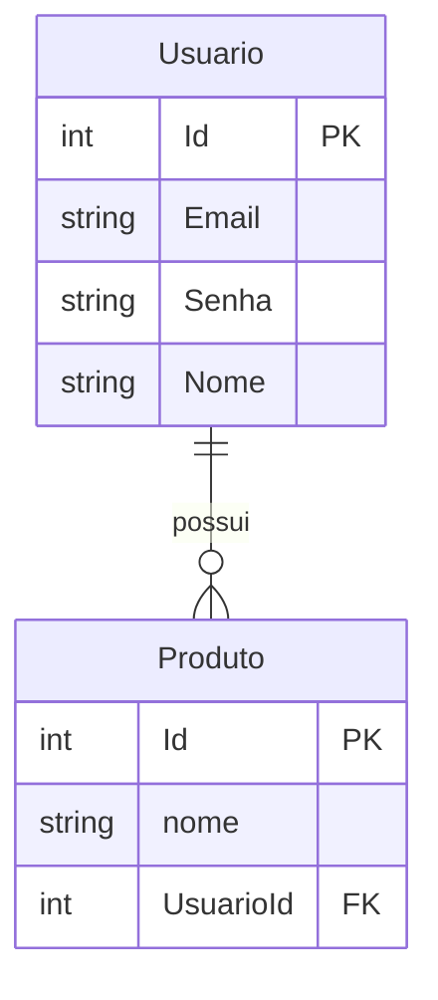

# Estoque_Agil

## Sobre o projeto
O Estoque_Ágil é uma API desenvolvida em ASP.NET Core, criada com o intuito de revisar conceitos fundamentais e praticar boas práticas no desenvolvimento de APIs.
O foco principal é aprender, aplicar e consolidar conhecimento em arquitetura limpa, versionamento de código e testes automatizados.
## Tecnologias utilizadas
ASP.NET Core

Entity Framework Core

MySQL(via docker)

Documentação com Swagger/OpenAPI
## Diagrama de Banco de Dados

## Funcionalidades (em andamento)
### Produto
Cadastro de produtos

Consulta de estoque

Atualização de produtos

Remoção de produtos

### Usuario
Cadastro de usuario

login

Atualização de usuario

consulta de usuario

Remoção de usuario

## O que está por vir 
Melhorar mensagens de commit seguindo boas práticas

Testes automatizados de unidade

Testes automatizados de integração
