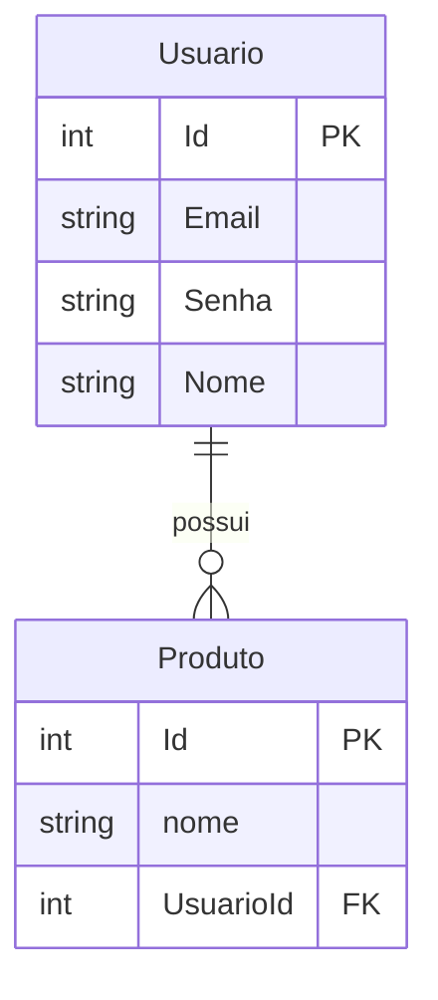

# Estoque Ágil 

 
 
 


**API de Controle de Estoque** desenvolvida em **ASP.NET Core**, com foco em boas práticas de desenvolvimento, testes automatizados, arquitetura limpa e documentação profissional.  

---
##  Objetivo do Projeto

O **Estoque Ágil** foi desenvolvido com o objetivo de **praticar e consolidar conhecimentos em desenvolvimento de APIs e back-end em C#**.  

Este projeto é um ambiente de aprendizado prático, onde foi possível:

- Aplicar conceitos de **arquitetura limpa** e boas práticas de desenvolvimento.  
- Criar endpoints RESTful utilizando **ASP.NET Core**.  
- Integrar a aplicação com **banco de dados relacional MySQL**.  
- Implementar **testes automatizados** para garantir qualidade do código.  
- Documentar a API usando **Swagger/OpenAPI**, facilitando testes e integrações futuras.

O foco principal não é apenas entregar um produto final, mas sim **aprender na prática como desenvolver o back-end de um sistema completo em C#**.


## 🛠 Tecnologias e Motivos

- **ASP.NET Core**: framework robusto para criar APIs RESTful de alto desempenho.
- **Entity Framework Core**: ORM que facilita o mapeamento entre banco relacional e objetos C#.
- **MySQL**: banco de dados relacional confiável, fácil de versionar e integrar via Docker.
- **Swagger/OpenAPI**: documentação interativa que facilita testes e integração com front-end.
- **xUnit**: framework de testes moderno e eficiente para unitários e integração.
- **Docker**: permite criar ambientes consistentes e isolados para o banco de dados.


---

## 🛠 Funcionalidades

### Produtos
- Cadastro de produtos  
- Consulta de estoque  
- Atualização de produtos  
- Remoção de produtos  

### Usuários
- Cadastro de usuário  
- Login  
- Atualização de usuário  
- Consulta de usuário  
- Remoção de usuário  

---

## 📊 Diagrama de Banco de Dados


## Skills Demonstradas

Back-End: ASP.NET Core, Entity Framework Core

Banco de Dados: MySQL, modelagem de dados, relacionamento

Boas Práticas: arquitetura limpa, versionamento, organização de commits

Testes(Em andamento): planejamento para testes unitários e de integração 

Documentação: Swagger/OpenAPI
##  Como Executar

Siga os passos abaixo para rodar a API **Estoque Ágil** localmente:

### 1️⃣ Clonar o repositório
```bash
git clone https://github.com/Arthur-MARKOWICZ/Estoque_Agil.git
cd Estoque_Agil
```
###2️⃣ Restaurar dependências

No diretório do projeto, execute:
```bash
dotnet restore
```

Isso irá baixar todas as bibliotecas e pacotes necessários para compilar a aplicação.

###3️⃣ Configurar e atualizar o banco de dados

O projeto utiliza MySQL, que pode ser executado via Docker ou localmente.
Depois de configurar o banco, rode:
```bash
dotnet ef database update

```
Isso aplicará todas as migrations e criará as tabelas necessárias.

###4️⃣ Executar a API

Para iniciar a API, execute:
```bash
dotnet run
```

A API estará disponível em:
```bash
https://localhost:5165/swagger
```

Abra este link no navegador para acessar a documentação interativa via Swagger, onde você pode testar todos os endpoints.

###5️⃣ Executar testes automatizados

O projeto possui testes planejados para unidade e integração. Para executá-los:
```bash
dotnet test
```

Isso irá rodar todos os testes e mostrar os resultados no terminal.

### 6️⃣ Observações importantes

Certifique-se de ter .NET SDK instalado (versão 9).

Caso utilize Docker, garanta que o container do MySQL esteja ativo.

Para problemas com certificados HTTPS, você pode rodar a API em HTTP temporariamente ajustando o arquivo launchSettings.json.
